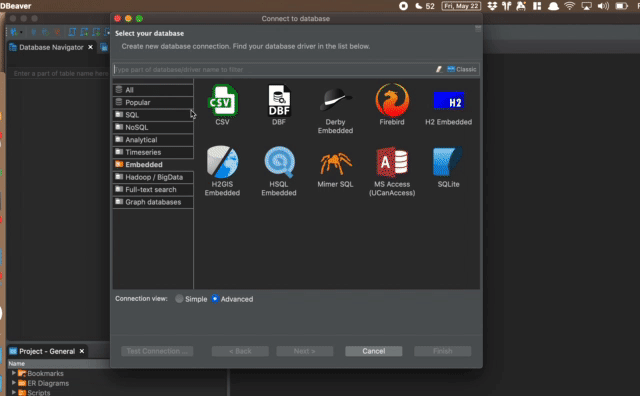
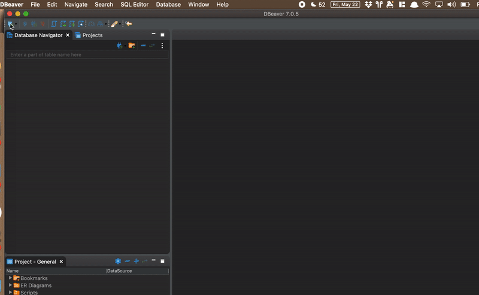
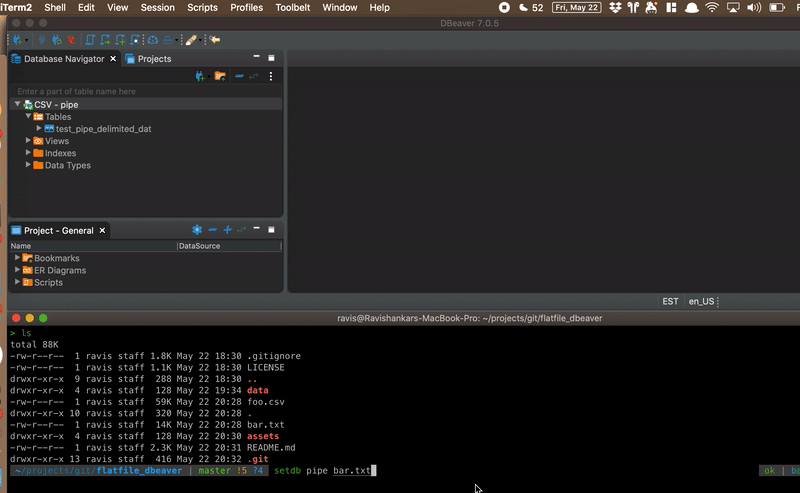

# Using flatfiles as database in dbeaver

## Usecases:
- query filter/group by or run any simple sql operation on a csv or any delimited file
- Dont want to create a new dbeaver connection for every file

## Solution:
- create a root folder that can be used for flatfiles
- create child folders csv, pipe, tsv .... so independent connections can be created for different file types in dbeaver. Here is my folder structure
```
├── data
│   ├── csv
│   │   └── dataset_csv_dat.csv
│   └── pipe
│       └── test_pipe_delimited_dat.csv
```
### One Time Setup
- create dbeaver connection for csv and set the path to data/csv


- create create dbeaver connection for pipe or any delimited file typ, set the path to data/pipe(or the format). Update the seperator in "Driver Properties"


- Add this shell function to zshrc or bash_profile
``` shell
#usage setdb pipe foo.dat or setdb bar.csv
#open CSV/TSV/PIPE delimited file in dbeaver
#set your DIRECTORY to folder where you wan to root directory where you want to store csv/tsv
# ARgument 1 is csv/tsv/pipe you also should create a folder under the db_root for csv/pipe or what ever delimiter
function setdb(){
	db_root=flatfile_dbeaver/data
	#Take file basename
	orig_filename="$(basename $2)"
	#replace . with _
	filename=${orig_filename//"."/"_"}
	#copy file to csv/tsv/pipe folder under dbroot based on $1 paramter
	eval "cp $2 $db_root/$1/$filename.csv"
}

```

## Usage for a csv file

- Let's say we get a csv file foo.csv. Run the below command and what this does is copies the foo.csv as foo_csv.csv to flatfile_dbeaver/data/csv
```
setdb csv foo.csv
```
- Refresh the csv file connection in dbeaver the new file will show as new table under the csv connection


## Usage for a pipe delimited file

- Let's say we get a pipe delimeited file bar.txt Run the below command and what this does is copies the bar.txt as bar_txt.csv to flatfile_dbeaver/data/pipe. Just to keep it simple for the dbeaver connection we use .csv you can change the extension the connection looks for in the Driver Properties
```
setdb pipe bar.txt
```
- Refresh the csv file connection in dbeaver the new file will show as new table under the csv connection



## Thank You!!